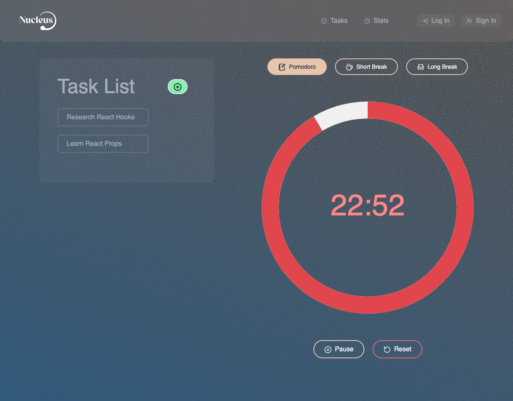
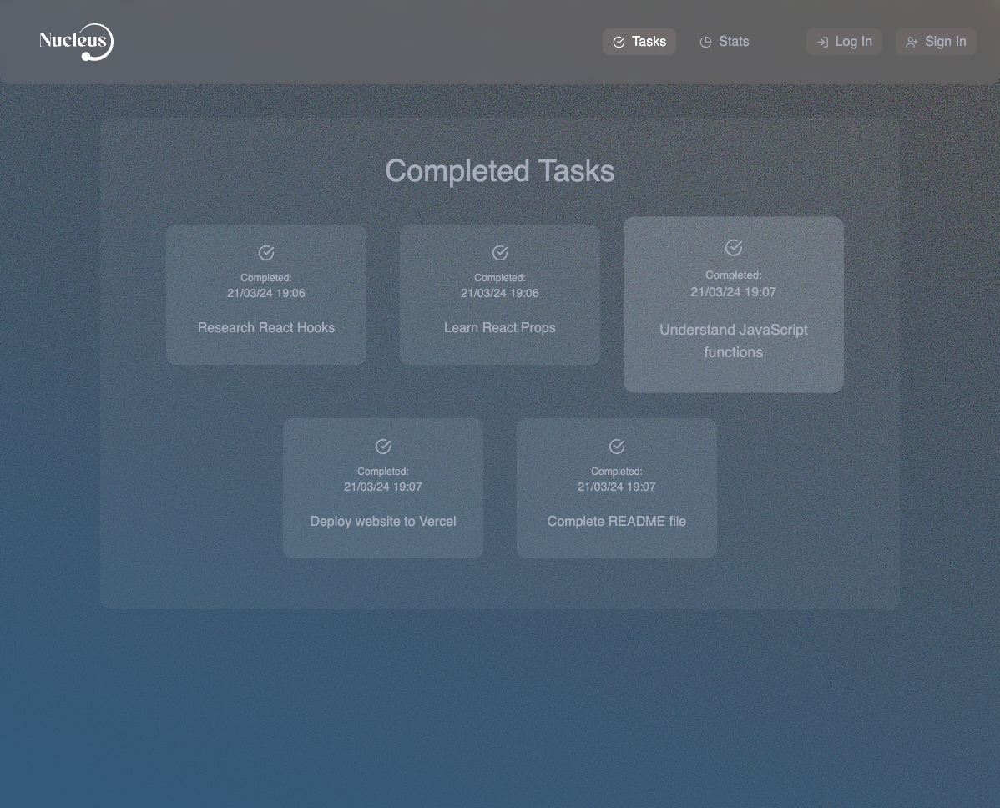
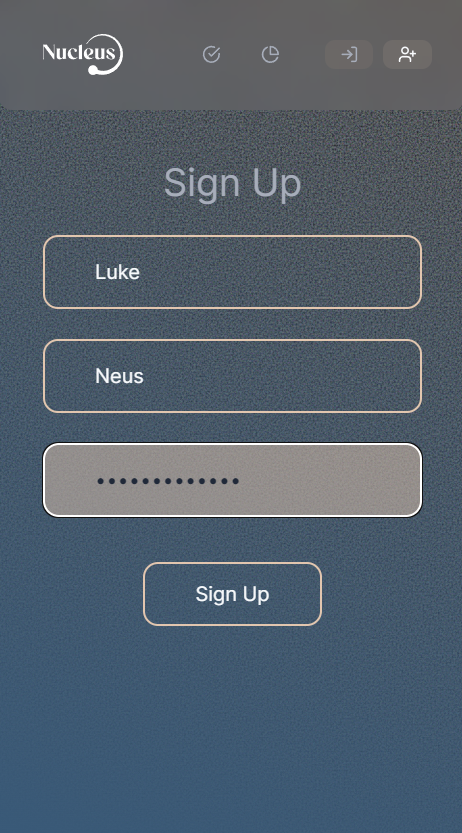
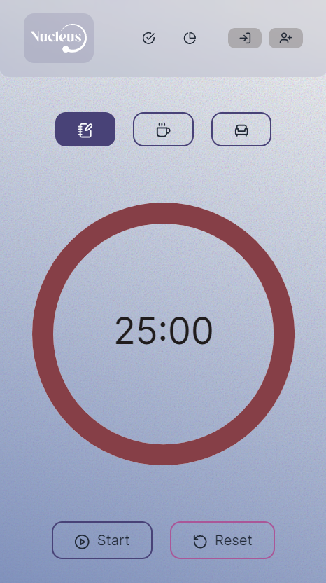

# Nucleus

## License

## Table of Contents

- [Description](#description)
- [Usage](#usage)
- [License](#license)
- [Images](#images)
- [Contributions](#contributions)
- [Credits](#credits)

## Description

The last few months of Bootcamp have taught us that time management is essential when it comes to studying.
Our app is based on the Pomodoro Technique, a tried-and-tested learning method that intersperses periods of concentration with set breaks. Topics of study are broken down to sessions of around 25 minutes to maximise focus, with enforced breaks between sessions to help with memory retention and decrease fatigue. It’s not just helpful for filling your mind, you can empty it too by using Nucleus as a meditation and mindfulness aid.

With a minimalist UI and customisable session and break lengths, Nucleus is a simple solution for tasks that may initially seem overwhelming, helps build better study habits and sends procrastination packing.

#### Technologies

- 
- 
- 
- 
- 
- 
- 
- 
- 
- 
- 
- 
- 
- 
- 
- 

#### NPM Packages

- [axios](https://www.npmjs.com/package/axios)
- [chart.js](https://www.npmjs.com/package/chartjs)
- [lucide-react](https://www.npmjs.com/package/lucide-react)
- [moment](https://www.npmjs.com/package/moment)
- [react](https://www.npmjs.com/package/react)
- [react-beautiful-dnd](https://www.npmjs.com/package/react-beautiful-dnd)
- [react-calendar](https://www.npmjs.com/package/react-calendar)
- [react-chartjs-2](https://www.npmjs.com/package/react-chartjs-2)
- [react-circular-progressbar](https://www.npmjs.com/package/react-circular-progressbar)
- [react-dom](https://www.npmjs.com/package/react-dom)
- [react-router-dom](https://www.npmjs.com/package/react-router-dom)

## Usage

[Deployed Site](https://nucleus-plum-zeta.vercel.app/)

This app can be solely used as a pomodoro timer or you could add things to your to-do list and tick them off as you go along.

1. Click the green '+' button if you wish to add to your list. (These can be edited or marked as complete).
2. Simply set the 25 minute timer off, once it hits zero you are notified by an alarm.
3. Once your time is up, you can select either a short or long break. Start the timer once more while you grab a drink or stretch your legs.
4. Any completed tasks can be viewed via the 'Tasks' link at the top of the screen.

## Images

Here are a few screenshots of the website.

#### Home Page

#### Completed tasks page

### Stats Page

### Login Page

### Mobile View

### Light Mode

## Contributions

[Callum Hilton](https://github.com/calltekk)  
[Jai Gandhi](https://github.com/jg2002-j)  
[Nicole Theodore](https://github.com/bootcampist)  
[Corinne Borgeaud](https://github.com/SpecialFriendRice)  
[Fathima Shazna Mohamed Abubacker](https://github.com/shazna8181)  
[Phil Cooper](https://github.com/PhilC7)

## Credits

[React](https://react.dev/)  
[MongoDB](https://www.mongodb.com/)  
